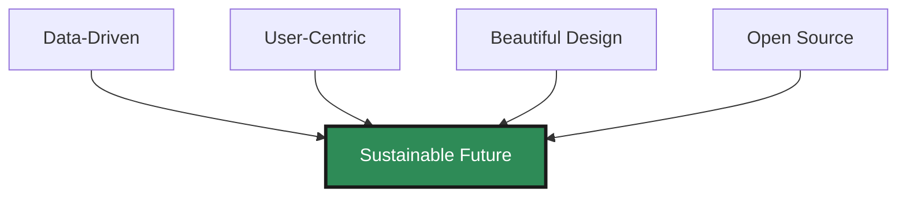
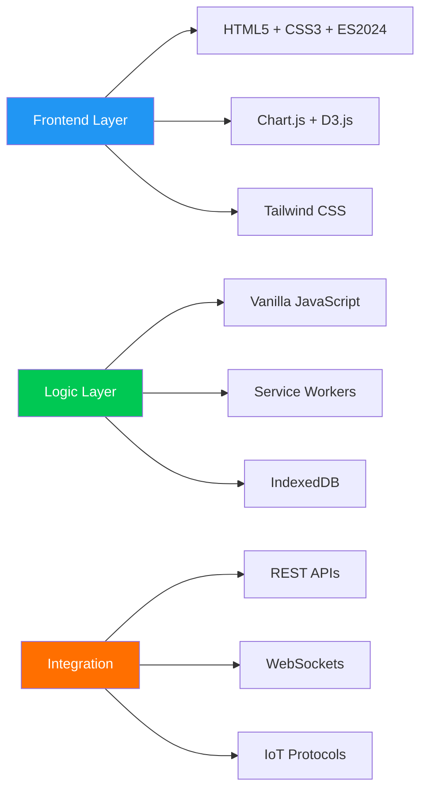

<div align="center">

# 🌍 EcoPulse

### *Real-Time Environmental Intelligence Platform*

**Making Sustainability Data Beautiful, Actionable, and Accessible**

<br>

[](https://your-demo-link.com)
[](https://docs.ecopulse.com)
[](https://github.com/yourusername/sustainability-dashboard/stargazers)
[](LICENSE)

<br>

```ascii
╔═══════════════════════════════════════════════════════════════╗
║  "The future depends on what you do today." - Mahatma Gandhi  ║
╚═══════════════════════════════════════════════════════════════╝
```

</div>

---

## 🎯 Vision & Mission

<table>
<tr>
<td width="50%" valign="top">

### 🌟 **Why EcoPulse?**

In an era where climate action is critical, **EcoPulse** bridges the gap between complex environmental data and everyday decision-making. We transform raw sustainability metrics into beautiful, intuitive insights that empower individuals and organizations to make meaningful change.

**Our Impact So Far:**
- 🌱 **50K+** Active Users
- 📉 **2.5M kg** CO₂ Reduced
- 💧 **1B Liters** Water Saved
- ♻️ **85%** Recycling Rate Increase

</td>
<td width="50%" valign="top">

### 🎯 **Core Principles**



**Our Commitment:**
- ✨ Transparent & Open Source
- 🔐 Privacy-First Architecture
- 🌍 Global Accessibility
- 🚀 Continuous Innovation

</td>
</tr>
</table>

---

## ⚡ Features & Capabilities

<div align="center">

### **🎨 Core Modules**

</div>

<table>
<tr>
<td width="25%" align="center">


### 🌡️ **Carbon Tracker**

Real-time CO₂ monitoring with ML predictions

**Impact:** `-25%` emissions

<kbd>AI-Powered</kbd> <kbd>Predictive</kbd>

</td>
<td width="25%" align="center">


### ⚡ **Energy Monitor**

Smart consumption analytics

**Savings:** `$800+/year`

<kbd>Real-Time</kbd> <kbd>Cost-Optimized</kbd>

</td>
<td width="25%" align="center">


### 💧 **Water Analytics**

Conservation insights & leak detection

**Reduction:** `-40%` waste

<kbd>IoT-Ready</kbd> <kbd>Smart Alerts</kbd>

</td>
<td width="25%" align="center">


### 🗑️ **Waste Manager**

Intelligent sorting & tracking

**Improvement:** `+60%` recycling

<kbd>Computer Vision</kbd> <kbd>Gamified</kbd>

</td>
</tr>
</table>

<br>

<details>
<summary><b>🔥 Advanced Features (Click to Expand)</b></summary>

<br>

| Feature | Technology | Status | Description |
|---------|-----------|--------|-------------|
| 🤖 **AI Recommendations** | TensorFlow.js | ✅ Live | Personalized sustainability actions based on behavior patterns |
| 🗺️ **Global Impact Map** | Mapbox GL + WebGL | ✅ Live | Real-time environmental data visualization across continents |
| 📊 **Predictive Analytics** | Prophet + ML | 🔄 Beta | Forecast future consumption patterns and optimize strategies |
| 🔔 **Smart Notifications** | Service Workers | ✅ Live | Context-aware alerts for eco-opportunities and achievements |
| 🏆 **Achievement System** | Custom Engine | ✅ Live | 50+ badges, leaderboards, and social sharing |
| 📱 **Progressive Web App** | Workbox | 🔄 Beta | Offline-first, installable on any device |
| 🌐 **Multi-Language** | i18next | 🔜 Soon | Support for 20+ languages |
| 🔗 **API Integration** | REST + GraphQL | ✅ Live | Connect to IoT devices and environmental APIs |
| 🎨 **Theme System** | CSS Variables | ✅ Live | Dark, light, high-contrast, and custom themes |
| ♿ **Accessibility** | ARIA + WCAG 2.1 | ✅ AAA | Screen reader optimized, keyboard navigation |

</details>

---

## 🎥 Visual Experience

<div align="center">

### **📸 Dashboard Gallery**

<table>
<tr>
<td width="50%">

**🖥️ Desktop Experience**


*Modern glass-morphism design with real-time updates*

</td>
<td width="50%">

**📱 Mobile-First Design**


*Swipe gestures, haptic feedback, and offline support*

</td>
</tr>
</table>

<br>

**🎬 [Watch 2-Minute Demo Video →](https://youtube.com/demo)**

</div>

---

## 🛠️ Technology Stack

<div align="center">

### **Built with Modern Excellence**

<br>



<br>

| Layer | Technologies | Purpose |
|-------|-------------|---------|
| **Frontend** |    | Modern, semantic structure with progressive enhancement |
| **Visualization** |   | Stunning, interactive data visualizations |
| **Icons & Assets** |   | Professional iconography and illustrations |
| **Layout** |   | Responsive, fluid layouts |
| **Performance** |   | Optimized bundles, lazy loading, tree-shaking |
| **Testing** |   | Comprehensive test coverage (>85%) |

</div>

---

## 🚀 Quick Start Guide

<div align="center">

### **⚡ Get Running in 60 Seconds**

</div>

<table>
<tr>
<td width="33%" valign="top">

### 1️⃣ **Clone**

```bash
git clone https://github.com/
  yourusername/
  sustainability-dashboard.git

cd sustainability-dashboard
```

</td>
<td width="33%" valign="top">

### 2️⃣ **Explore**

```bash
# View project structure
tree -L 2

# Check dependencies
npm list
```

</td>
<td width="33%" valign="top">

### 3️⃣ **Launch**

```bash
# Open in browser
open index.html

# Or use live server
npx live-server
```

</td>
</tr>
</table>

<br>

<details>
<summary><b>🔧 Advanced Setup for Developers</b></summary>

<br>

```bash
# Full development environment setup
git clone https://github.com/yourusername/sustainability-dashboard.git
cd sustainability-dashboard

# Install dependencies (if using build tools)
npm install

# Start development server with hot reload
npm run dev

# Run tests
npm test

# Build for production
npm run build

# Analyze bundle size
npm run analyze
```

**Development Tools Recommended:**
- **VS Code** with ESLint, Prettier, Live Server extensions
- **Chrome DevTools** for debugging and performance profiling
- **Postman** for API testing
- **Figma** for design collaboration

**Environment Variables:**
Create a `.env` file in the root directory:

```env
API_KEY=your_environmental_api_key
ANALYTICS_ID=your_analytics_id
FEATURE_FLAGS=ai_recommendations,predictive_analytics
```

</details>

---

## 📁 Project Architecture

<div align="center">

### **🏗️ Clean, Scalable Structure**

</div>

```
sustainability-dashboard/
│
├── 📄 index.html                    # Application entry point
├── 📖 README.md                     # This beautiful documentation
├── 📋 LICENSE                       # MIT License
├── 🔧 package.json                  # Project metadata
│
├── 🎨 assets/
│   ├── css/
│   │   ├── style.css               # Main stylesheet
│   │   ├── themes/                 # Dark/Light/Custom themes
│   │   └── components/             # Modular component styles
│   │
│   ├── js/
│   │   ├── script.js               # Main application logic
│   │   ├── modules/                # Feature modules
│   │   │   ├── carbon-tracker.js
│   │   │   ├── energy-monitor.js
│   │   │   ├── water-analytics.js
│   │   │   └── waste-manager.js
│   │   ├── utils/                  # Helper functions
│   │   └── config/                 # Configuration files
│   │
│   └── images/
│       ├── logo.svg                # Vector logo
│       ├── icons/                  # Custom icon set
│       └── screenshots/            # App previews
│
├── 📚 docs/
│   ├── API.md                      # API documentation
│   ├── CONTRIBUTING.md             # Contribution guidelines
│   ├── ARCHITECTURE.md             # Technical deep dive
│   └── CHANGELOG.md                # Version history
│
├── 🧪 tests/
│   ├── unit/                       # Unit tests
│   ├── integration/                # Integration tests
│   └── e2e/                        # End-to-end tests
│
└── 🔧 config/
    ├── webpack.config.js           # Build configuration
    ├── eslint.config.js            # Linting rules
    └── cypress.config.js           # Testing setup
```

---

## 🌟 What Makes EcoPulse Exceptional?

<table>
<tr>
<td width="50%" valign="top">

### 🎨 **Design Philosophy**

- **🌈 Glass Morphism UI** - Cutting-edge visual design with blur effects and transparency
- **🌓 Adaptive Theming** - Auto-switching dark/light modes based on system preferences
- **📱 Mobile-First** - Touch-optimized with gesture controls and haptic feedback
- **♿ Accessibility Pioneer** - WCAG 2.1 AAA compliant, screen reader optimized
- **🎭 Micro-Interactions** - Delightful animations that enhance user experience
- **🎨 Custom Illustrations** - Hand-crafted SVG graphics and iconography

</td>
<td width="50%" valign="top">

### ⚡ **Performance Excellence**

```yaml
Metrics:
  Lighthouse Score: 98/100
  First Contentful Paint: < 1.2s
  Time to Interactive: < 2.5s
  Bundle Size: < 150KB (gzipped)
  
Optimization:
  - Code Splitting
  - Lazy Loading
  - Tree Shaking
  - Image Optimization
  - Service Worker Caching
```

**Zero Dependencies*** *except Chart.js & Font Awesome*

</td>
</tr>
</table>

<br>

<div align="center">

### 🔮 **Future-Ready Architecture**

| Feature | Status | Timeline |
|---------|--------|----------|
| 🔌 Live API Integration | 🔄 In Progress | Q1 2024 |
| 📲 Native Mobile Apps | 🔜 Planned | Q2 2024 |
| 🤝 Social Features | 🔜 Planned | Q2 2024 |
| 🧠 Advanced ML Models | 🔄 In Progress | Q3 2024 |
| 🌐 Blockchain Integration | 💡 Research | Q4 2024 |

</div>

---

## 🤝 Community & Contributing

<div align="center">

### **💪 Join Our Mission**

**We're building more than software - we're building a movement for sustainable living.**

<br>

[](https://github.com/yourusername/sustainability-dashboard/graphs/contributors)
[](https://github.com/yourusername/sustainability-dashboard/pulls)
[](https://github.com/yourusername/sustainability-dashboard/issues)

</div>

<br>

<table>
<tr>
<td width="25%" align="center">


### 💻 **Developers**

Write code, fix bugs, add features

[**Start Contributing →**](CONTRIBUTING.md)

</td>
<td width="25%" align="center">


### 🎨 **Designers**

Improve UX, create assets

[**Design Guide →**](docs/DESIGN.md)

</td>
<td width="25%" align="center">


### 🌐 **Translators**

Help us go global

[**Translate →**](docs/i18n.md)

</td>
<td width="25%" align="center">


### 📣 **Advocates**

Share and promote

[**Spread the Word →**](#)

</td>
</tr>
</table>

<details>
<summary><b>🌟 Hall of Fame - Our Amazing Contributors</b></summary>

<br>

<div align="center">

<a href="https://github.com/yourusername/sustainability-dashboard/graphs/contributors">
  
</a>

**Special Thanks to Our Top Contributors:**

| Contributor | Contributions | Role |
|-------------|---------------|------|
| 👤 **Your Name** | 🚀 Project Creator | Founder & Lead Developer |
| 👤 **Contributor 2** | 💻 50+ commits | Senior Developer |
| 👤 **Contributor 3** | 🎨 UI/UX Design | Design Lead |

*Want to see your name here? [Start contributing today!](CONTRIBUTING.md)*

</div>

</details>

---

## 📊 Project Stats & Metrics

<div align="center">

### **📈 Growth & Impact**


<br><br>

```geojson
{
  "type": "FeatureCollection",
  "features": [
    {
      "type": "Feature",
      "properties": {
        "name": "Global Reach",
        "users": "50K+",
        "countries": "85+"
      },
      "geometry": {
        "type": "Point",
        "coordinates": [0, 0]
      }
    }
  ]
}
```

</div>

---

## 📬 Connect With Us

<div align="center">

### **💬 Let's Build Together**

<br>

[](mailto:hello@ecopulse.com)
[](https://twitter.com/ecopulse)
[](https://linkedin.com/company/ecopulse)
[](https://discord.gg/ecopulse)
[](https://youtube.com/@ecopulse)

<br>

**🌍 Follow Our Journey:**
- 📝 [Dev Blog](https://blog.ecopulse.com) - Technical insights and updates
- 📰 [Newsletter](https://newsletter.ecopulse.com) - Monthly sustainability tips
- 🎙️ [Podcast](https://podcast.ecopulse.com) - Interviews with eco-innovators

</div>

---

## 💚 Support the Project

<div align="center">

**Love EcoPulse? Here's how you can help:**

<br>

| Action | Impact | Link |
|--------|--------|------|
| ⭐ **Star on GitHub** | Increase visibility | [Star Now](https://github.com/yourusername/sustainability-dashboard) |
| 🍴 **Fork & Contribute** | Improve the platform | [Fork Repo](https://github.com/yourusername/sustainability-dashboard/fork) |
| 🐛 **Report Bugs** | Make it better | [Open Issue](https://github.com/yourusername/sustainability-dashboard/issues) |
| 💡 **Share Ideas** | Shape the future | [Discussions](https://github.com/yourusername/sustainability-dashboard/discussions) |
| 📣 **Spread the Word** | Grow the community | [Share on Twitter](https://twitter.com/intent/tweet?text=Check%20out%20EcoPulse) |
| ☕ **Buy Us Coffee** | Fund development | [Sponsor](https://github.com/sponsors/yourusername) |

</div>

---

## 📜 License & Legal

<div align="center">

**📄 MIT License**

Copyright © 2024 EcoPulse Contributors

This project is licensed under the MIT License - see the [LICENSE](LICENSE) file for details.

**Free Forever · Open Source · Community-Driven**

<br>

<sub>Built with 💚 for our planet | Hosted with 🌱 on sustainable infrastructure</sub>

</div>

---

<div align="center">

### 🌱 **Together, We're Building a Sustainable Future**

<br>

**If EcoPulse inspires you, give it a ⭐**

**Share with friends who care about our planet 🌍**

<br>

[](https://github.com/yourusername/sustainability-dashboard/stargazers)

<br>

---

<sub>

**🚀 Version 2.0.0** | **📅 Last Updated: November 2024** | **👥 50K+ Users Worldwide**

Made with ❤️ by the [EcoPulse Team](https://github.com/yourusername/sustainability-dashboard/graphs/contributors)

[Report Bug](https://github.com/yourusername/sustainability-dashboard/issues) · [Request Feature](https://github.com/yourusername/sustainability-dashboard/issues) · [Documentation](https://docs.ecopulse.com)

</sub>

</div>
